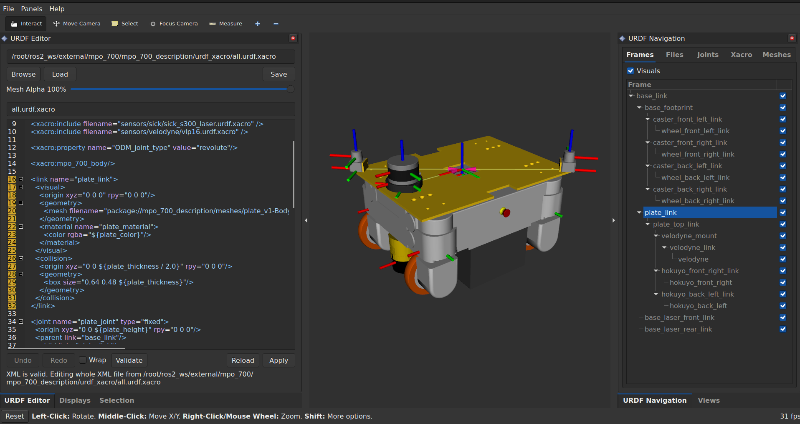

# rviz2_urdf_editor



`rviz2_urdf_editor` adds native RViz URDF/xacro editing panels. It is intended
for interactive robot-description work inside
RViz: load a URDF or xacro, inspect the expanded model, jump from frames and
macros to their source files, edit XML in memory, preview the result in RViz,
and save the changed source files only when explicitly requested.

## Quick Start

```bash
ros2 launch rviz2_urdf_editor editor.launch.py
```

Change the path in the URDF/Xacro file widget to edit another robot.

## Panels

The package exports these RViz panels:

- `rviz2_urdf_editor/UrdfEditorPanel`: loads, saves, publishes, and edits the
  active URDF/xacro source XML.
- `rviz2_urdf_editor/UrdfNavPanel`: provides Frames, Files, Joints, Xacro, and
  Meshes tabs for navigating and previewing the loaded robot description.

## Editing Workflow

1. Select a URDF or xacro file in the file widget and press `Load`.
2. Use the frame tree, file list, macro list, or mesh list to open XML in the
   editor.
3. Edit XML in the editor.
4. Press `Apply` to apply the change in memory and rebuild the preview.
5. Press `Save` in the file widget to write all sticky files to disk.

`Apply` never writes files to disk. It only updates the in-memory source text,
re-expands the xacro, updates the preview, and marks affected files sticky.

`Save` is the only button that writes source files. It saves the loaded source
file and any changed included xacro files.

## Sticky Files

A sticky file is a file with in-memory changes that would be written by `Save`.
Sticky state is shown in the files widget and as `*` next to the current editor
file name.

Sticky state is updated while editing, including comment-only xacro changes.
Opening an editor should not mark a file sticky by itself.

## Xacro Source Lookup

When a link or joint is generated by a xacro macro, the editor tries to open the
source xacro that defines the macro instead of only showing the expanded XML.

If no specific source range can be found, the editor falls back to opening the
best matching xacro file.

## Preview and Publishing

The file widget can publish the active robot description on
`/robot_description`. It also starts a shared `robot_state_publisher` runtime for
the preview.

The editor publishes a static TF from:

```text
editor -> <robot base frame>
```

This lets RViz use `editor` as the fixed frame while keeping the robot visible.

The joint state widget publishes joint states repeatedly when auto publish is
enabled. This keeps dynamic robot-state-publisher TFs alive.
